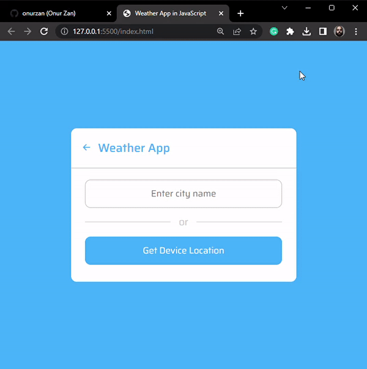

<h1>Weather App with Java Script</h1>

<h2>Used Tech</h2>

I mainly used HTML, CSS, BS(for icons) and JS. I learned to pull current and instant data with Java Script using the openweather API.

<h6>Take a quick look</h6>

